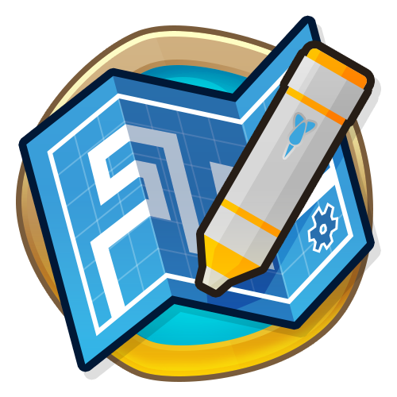

<h1 align="center">

ArtifactAndPerkEnabler
</h1>

Allows you to turn on perks from social seasons and artifacts from rogue legends in any game mode. Ther mod only work if you are flagged to keep unflagged people from messing with social seasons. The artifacts also only work if you have purchased the DLC as otherwise you could get most of the crazy interactions without purchasing it.

